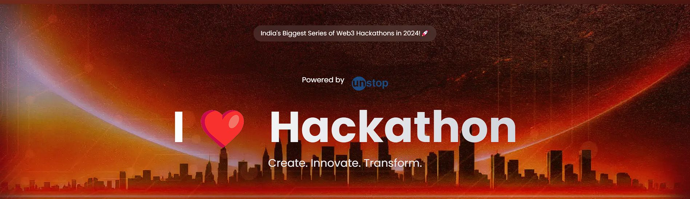

# PokeChain - Web3 Pokemon Training Game

This project was a part of 24 Hour National Web3 Hackathon hosted by MLSC VIT (Vishwakarma Institute of Technology).
Our team **SEA KING INTERN SHIPS**, after hours of brainstorming - coding - refining, presented a solution that stood out among a field of incredibly talented participants. We came **1st Runner Ups** in the competition our of 60 other teams.

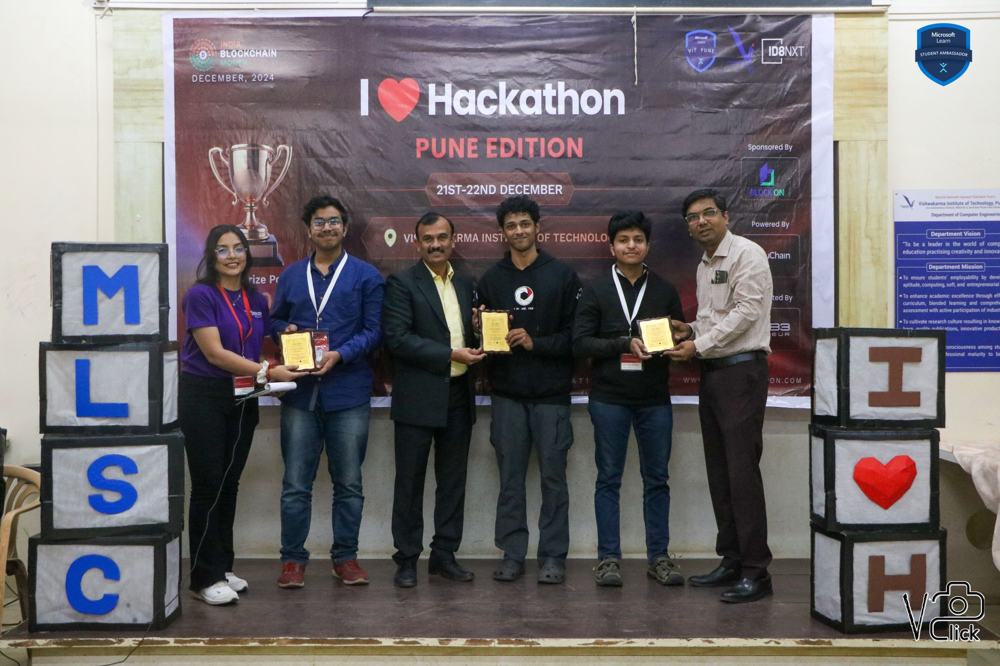

## Team Members

- [Kedar Vartak](https://www.linkedin.com/in/kedar-vartak20/) - **Team Lead**
- [Tirthraj Mahajan](https://www.linkedin.com/in/tirthraj-mahajan/)
- [Harsh Badagandi](https://www.linkedin.com/in/harsh-badagandi-57558225a/)

## Problem Statement

Creating games using blockchain technology. Explore the potential of play-to-earn and decentralized gaming.

## Project Description

PokeChain is a decentralized Pokemon training game built on the Ethereum blockchain. It combines the beloved Pokemon universe with blockchain technology, allowing players to own, train, and battle with their Pokemon as unique digital assets.

### Tagline

**Train. Stake. Earn.**

### Key Features

- **Connect Wallet**: Players connect their Ethereum wallet to get started.
- **Starter Pokemon**: Choose a unique starter Pokemon secured through ERC-1155 tokens.
- **XP and Value Growth**: Train Pokemon to gain XP, increasing their value as unique blockchain assets.
- **Balanced Economy**: A starter pack distribution system ensures fairness for new players.
- **Training Options**:
  - Spend in-game currency (Pokecoins) to train with a wait time.
  - Battle wild Pokemon through a Unity-based web game reminiscent of classic Pokemon games (FireRed/LeafGreen).
- **Marketplace**: Use Pokecoins to buy items.
- **Helper App**: A Flutter-based mobile app for tracking your Pokemon by connecting your wallet.

## Technology Stack

### Frontend

- **React.js**: Modular UI components for a seamless user experience.
- **Web3.js**: Connects the app to the Ethereum blockchain.

### Backend

- **Node.js & Express**: Server-side logic for Authentication and Mobile App Features.
- **Flask**: APIs for NFT generation using AI Models
- **Redis and Celery Worker**: Creating fast asynchronous pipelines for NFT generation
- **PostgreSQL**: Stores information about the user and NFTs

### Blockchain

- **Linea Blockchain (Ethereum Layer 2)**: Secure and low-cost transactions.
- **ERC-1155**: Token standard for unique and semi-fungible assets.
- **ERC-20**: Token standard for Pokecoins.
- **ERC-721**: Token standard for trading unique assets.
- **Ethers.js**: Simplified blockchain interactions and smart contracts.

### Tools

- **MetaMask**: Wallet integration for user authorization.
- **Hardhat**: Development, testing, and deployment of smart contracts.

### Game and AI

- **Unity**: Game engine for creating battles and interactions.
- **Hugging Face**: Multiple AI models for generating Pokemon cards and sprites.
- **Gemini**: Unique description generation for pokemon cards

### Mobile App

- **Flutter**: Helper app to manage and track Pokemon stats and wallet interactions.

### Design

- Custom pixel-perfect UI.
- Retro-modern aesthetic.
- Responsive design.
- Animated interactions.

## Core Gameplay

- **Starter Pokemon Selection**: Choose from classic starter Pokemon to begin your journey.
- **Pokemon Training**: Level up your Pokemon through training mechanisms.
- **Battle System**: Challenge other trainers in Pokemon battles.
- **Experience Points (XP)**: Earn XP through various activities.
- **Item Shop**: Purchase Pokeballs and other items using cryptocurrency.

## How to Play

1. **Connect Wallet**: Link your Web3 wallet to get started.
2. **Choose Starter**: Select your first Pokemon from three available starters.
3. **Train and Battle**:
   - Train your Pokemon to gain XP.
   - Battle other trainers and collect rewards.
4. **Buy Items**: Purchase Pokeballs and other items from the marketplace.
5. **Build Your Team**: Expand your Pokemon collection and create powerful teams.

## Web3 Integration

- **Digital Ownership**: True ownership of Pokemon and items through NFTs.
- **Blockchain Transactions**: Secure trading and battling system.
- **Smart Contracts**: Transparent and fair gameplay mechanics.
- **Wallet Integration**: Connect with MetaMask and other Web3 wallets.

---

## Unique Selling Point

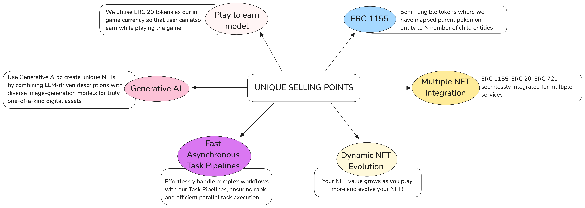

## Photos of our project

### Website

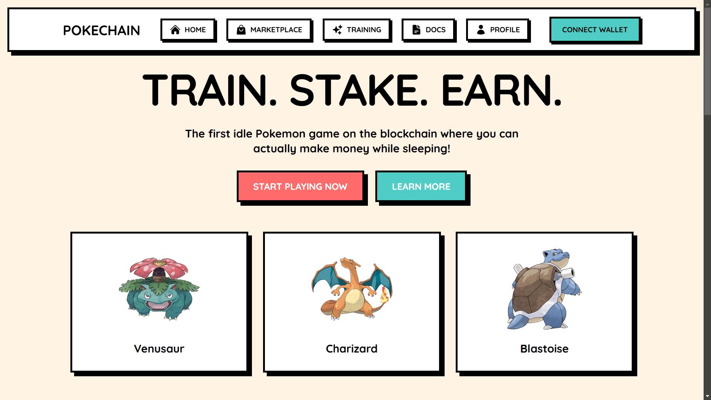
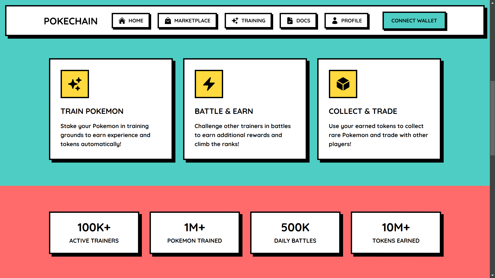
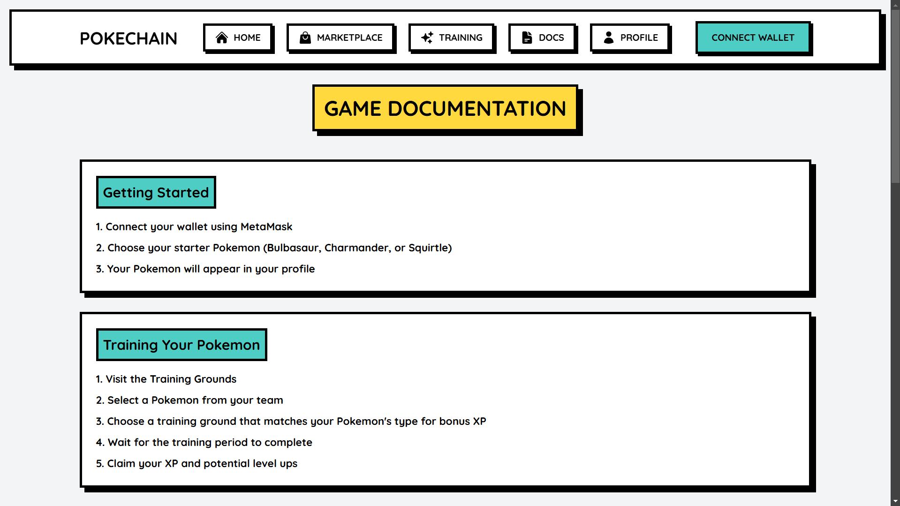

### Unity Game (Embedded)

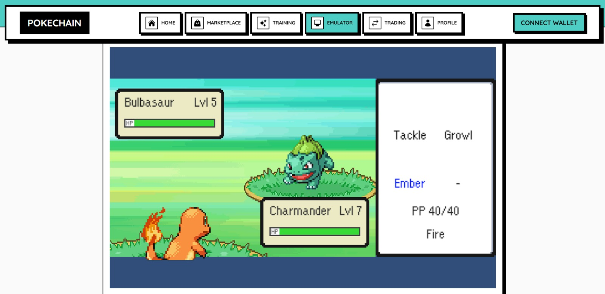

### Application

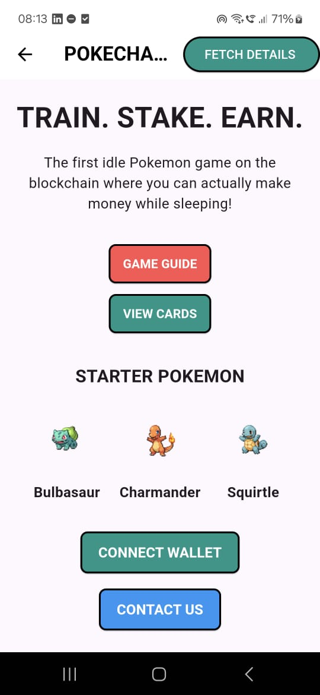
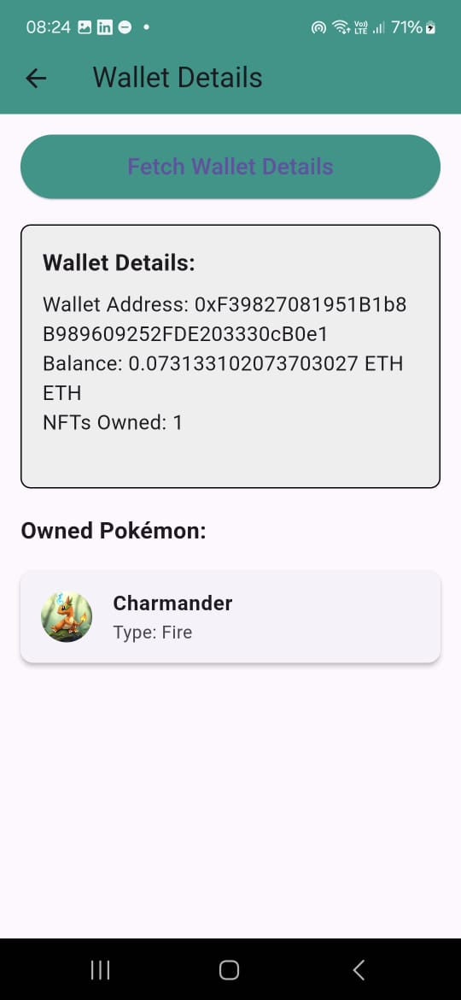

### NFT and NFT generation

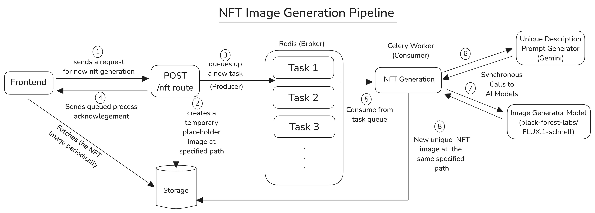
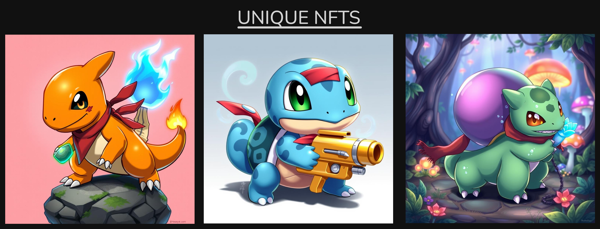

## Roadmap

### Phase 1 - Foundation

- Basic game mechanics
- Wallet integration
- Starter Pokemon system
- Item marketplace

### Phase 2 - Expansion

- Battle system implementation
- Training mechanisms
- Reward system
- Additional Pokemon

### Phase 3 - Enhancement

- Multiplayer features
- Tournament system
- Trading platform
- Community features

---

## Acknowledgments

- Pokemon sprites from PokeAPI
- OpenZeppelin for smart contract libraries

---

### Ready to join the decentralized Pokemon world? Connect your wallet and start training today!
